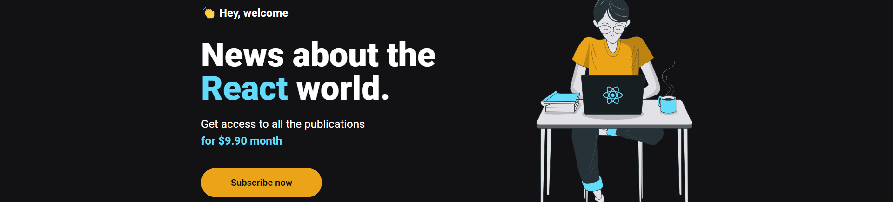

<h1 align="center">Ig.News</h1>
<h3 align="center">Por André Altoé</h3>

  

<!-- TABLE OF CONTENTS -->
<h2 id="summary"> :book: Sumário</h2>

  
Sumário

  <ol>
    <li><a href="#sobre"> ➤ Sobre</a></li>
    <li><a href="#tecnologias"> ➤ Tecnologias</a></li>
     <li><a href="#como-rodar"> ➤ Como Rodar</a></li>
    <li><a href="#creditos"> ➤ Creditos</a></li>
  </ol>

<!-- ABOUT THE PROJECT -->
<h2 id="sobre"> :pencil: Sobre</h2>

Desafio referente ao terceiro módulo do curso Ignite na Rocketseat, onde nos foi dado o objetivo de criar um blog com next.js consumindo os dados de um backend remoto com um headless CMS chamado Prismic, além disso, as postagens são mostradas apenas para membros inscritos, para o pagamento foi utilizado o Stripe e para guardar os usuários no banco de dados foi utilizado o FaunaDB, além da autenticação social com o Github.

<!-- ABOUT THE PROJECT -->
<h2 id="tecnologias"> :hammer: Tecnologias</h2>

<ul>
    <li><a href="https://www.github.com/" title="Github">
    <li></li>
    <li></li>
    <li></li>
    <li><a href="https://nextjs.org/" title="Next.js"> Next Js</a></li>
    <li><a href="https://www.typescriptlang.org/" title="Typescript"> Typescript</a></li>
    <li><a href="https://reactjs.org/" title="React"> React Js</a></li>
    <li><a href="https://yarnpkg.com/" title="Yarn"> Yarn</a></li>
    <li><a href="https://code.visualstudio.com/" title="Visual Studio Code"> Visual Studio Code</a></li>
</ul>

<!-- ABOUT THE PROJECT -->
<h2 id="como-rodar"> :nut_and_bolt: Como Rodar</h2>

Para rodar essa aplicação localmente é necessário que você primeiro crie sua conta nos seguintes serviços: Prismic, Stripe, Github e Fauna. Após isso, configurar suas variáveis de ambiente com as seguintes chaves:

<pre><code># Stripe

STRIPE_API_KEY
NEXT_PUBLIC_STRIPE_PUBLIC_KEY
STRIPE_WEBHOOK_SECRET
STRIPE_SUCCESS_URL
STRIPE_CANCEL_URL

# Github

GITHUB_ID
GITHUB_SECRET

# FaunaDB

FAUNADB_KEY

# Prismic CMS

PRISMIC_ENDPOINT
PRISMIC_ACCESS_TOKEN</code></pre>

    Você pode rodar o projeto em ambiente de desenvolvimento simplesmente digitando os seguintes comandos em seu terminal:

<pre><code>$ yarn
$ yarn dev</code></pre>

    Caso esteja a utilizar o Node na versão 17 será necessário acrescentar uma opção na inicialização, podendo ser rodado com:

<pre><code>$ yarn dev17</code></pre>

<!-- ABOUT THE PROJECT -->
<h2 id="creditos"> :eyeglasses: Creditos</h2>

> Feito com 💙 Por André Altoé :wave:

Durante o curso Ignite da Rocketseat
